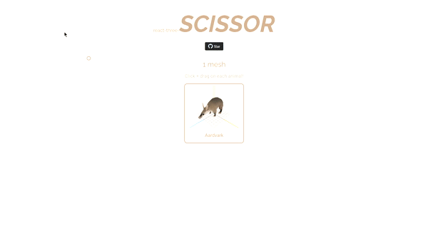

<p align="center">
   
  <h1 align="center"><sup>react-three-</sup>Scissor</h1>
  
  <p align="center">
  Multiple scenes, one canvas! WebGL Scissoring implementation for React Three Fiber.
  </p>
</p>

<p align="center">
  <h1 align="center">Depricated! Use <a href="https://github.com/pmndrs/drei#view"><code>&lt;View /&gt;</code></a> from <code>react-three-drei</code></h1>
</p>


<details>
<summary>Show depricated readme</summary>
   
<br />

<p align="center">
  <a href="" target="_blank"></a>

</p>
<p align="middle">
  <i>This demo is real, you can click it! They contains the <a href="https://github.com/FarazzShaikh/react-three-scissor/tree/main/example">full code</a>, too. 📦</i>
</p>
<br />

## Why this?

Havigng multiple WebGl contests within one webpage is generally a bad idea because (from [ThreeJS manual](https://threejs.org/manual/?q=mul#en/multiple-scenes)):

- **The browser limits how many WebGL contexts you can have.** Typically that limit is around 8 of them. As soon as you create the 9th context the oldest one will be lost.
- **WebGL resources can not be shared across contexts.** That means if you want to load a 10 meg model into 2 canvases and that model uses 20 meg of textures your 10 meg model will have to be loaded twice and your textures will also be loaded twice. Nothing can be shared across contexts. This also means things have to be initialized twice, shaders compiled twice, etc. It gets worse as there are more canvases.

To solve this, we create the issusion of these being multiple canvases by having one large one and drawing on very speciifc parts of it. This process is calld Scissoring.

The ThreeJS manual gives us a very complete guide ofhow to do this in ThreeJS but I have finall come around to using React Three Fiber and this library helps to set up Scissoring with relative ease.

## Usage

```tsx
import {
  ScissorCanvas, // <- R3F Canvas wrapper
  ScissorWindow, // <- The <div> to use as a "virtual canvas"
  ScissorScene, // <- The <scene> to be rendered witin a given virtual canvas
  useScissorFrame, // <- Like useFrame, provides access to the Scissoring render loop
  useScissorInit, // <- Window into the first run of useScissorFrame. Used to initialize whatever you want
} from "react-three-scissor";

function Scene() {
  // Since each scene has its own camera we need to set up
  // things like Orbit Controls impatively
  const orbit = useRef<OrbitControls>();

  useScissorInit(
    ({ camera, element, scene }) => {
      orbit.current = new OrbitControls(camera, element);
    },
    ["window-1", "window-2"]
  );

  useScissorFrame(
    (state) => {
      if (orbit.current) {
        orbit.current.update();
      }
    },
    ["window-1", "window-2"]
  );

  return (
    <>
      {/* Scene will be rendered in window with matching ID */}
      <ScissorScene uuid={"window-1"}>
        <mesh>...</mesh>
      </ScissorScene>
      <ScissorScene uuid={"window-2"}>
        <mesh>...</mesh>
      </ScissorScene>
    </>
  );
}

function App() {
  return (
    <>
      <ScissorCanvas
        //Pass any <Canvas> props
        gl={{
          antialias: true,
        }}
        shadows
      >
        <Scene />
      </ScissorCanvas>

      {/* Virtual Canvases with unique IDs */}
      <ScissorWindow uuid={`window-1`} />
      <ScissorWindow uuid={`window-2`} />
    </>
  );
}
```
</details>
